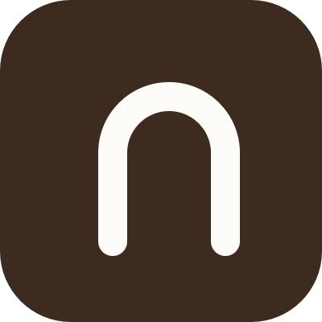

  
  <h1>Nook</h1>

**Nook** is a real-time cafe discovery and reservation platform designed to help users find the optimal workspace, while empowering cafe owners with tools to efficiently manage their occupancy and reservations.

## Project Overview

-   **User Application**: Enables users to discover cafes with real-time insights into atmosphere, occupancy levels, and seat availability. Features include table reservations, live story updates, and check-in capabilities.
-   **Admin Dashboard**: Provides cafe owners with a comprehensive interface to manage reservations, configure floor plans, upload content, and monitor real-time occupancy metrics.

## Quick Links

| Application | Platform | URL |
| :--- | :--- | :--- |
| **Mobile App** | Google Play Store | [Download](https://play.google.com/store/apps/details?id=com.yashk11.nook) |
| **Mobile App** | Apple App Store | [Download](#) |
| **Admin Dashboard** | Web | [Visit Dashboard](#) |

## Technology Stack

### Mobile Application (Client)
-   **Framework**: React Native (via Expo)

### Admin Dashboard (Business)
-   **Framework**: Next.js (React)
-   **Language**: TypeScript
-   **Styling**: Tailwind CSS

### Backend & Infrastructure
-   **API**: Python (FastAPI)
-   **Database**: PostgreSQL (SQLAlchemy ORM)
-   **Authentication**: AWS Cognito
-   **Storage**: AWS S3 (Presigned URLs for secure uploads)
-   **Compute**: AWS Lambda (Serverless Architecture)
-   **Infrastructure**: AWS CDK (Infrastructure as Code)
